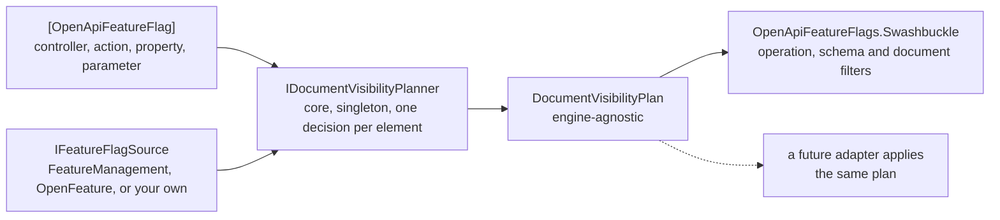

# Design

Why this library is shaped the way it is, and the measurements that shaped it. For how to *use* it,
see the [README](../README.md).

Two independent axes — the document engine and the flag source — are the whole design. Adding a second
engine must not touch the core; adding a second provider must not touch the adapter.

Everything under "Decisions", "Design invariants" and "Verified technical facts" was settled or
measured rather than guessed, so changing one of those is a design change rather than a cleanup.
"Open questions" is where choices are still live.

---

## 1. Why this library exists

A team shipped a feature that was still behind a feature toggle. The OpenAPI document published to
customers described the endpoints anyway, because the document is generated from the code, and the
toggle only gates runtime behaviour. Customers saw documented API surface they could not use.

The fix is to make the *document* respect the same flags the runtime does: mark the endpoint, action,
or schema property, and it only appears in the generated document once the flag is enabled.

This is generalisable and not specific to that team, which is why it is a standalone library.

---

## 2. Decisions (locked)

| # | Decision | Rationale | Alternatives rejected |
|---|---|---|---|
| D1 | Gate documents via a declarative attribute | Zero plumbing at the call site; discoverable next to the code it describes | Conditionally compiling controllers; runtime-only `[FeatureGate]` (does not affect documents) |
| D2 | The attribute is **documentation-only** | A docs decision must never silently become a behaviour change. Runtime gating stays in application code | One attribute doing both |
| D3 | Granularity: controller, action, property, parameter | Per-property is required (hiding one field of a response model). Multiple attributes on one target = AND | Operation-level only |
| D4 | Three modes: `Remove` (default), `Annotate`, `Include` | `Remove` fixes the customer-facing problem. `Annotate` emits `x-feature-flag` so portals can filter non-destructively. `Include` is the per-environment off switch | Single hard-coded behaviour |
| D5 | **Fail closed** on an unresolvable flag | A missing/erroring flag must hide the surface, never leak it | Fail open |
| D6 | Guard the inverse risk too | If the flag source is unreachable, fail-closed would silently *remove released endpoints* from a published document. Abort instead, e.g. fail if zero flags resolve | Ignoring it |
| D7 | Global flags only, no per-merchant targeting | A document is not tenant-scoped. A partially rolled-out flag is hidden entirely; early-access merchants get no public docs for it. Accepted | Per-tenant documents |
| D8 | **Two independent axes**: document engine × flag source | Adding NSwag must not touch the core; adding OpenFeature must not touch the Swashbuckle adapter | A Swashbuckle-specific library |
| D9 | Core produces an **engine-agnostic plan**; adapters apply it | The core never touches a document model, so each adapter walks its own object graph | Core aware of `OpenApiDocument` |
| D10 | `*.Abstractions` is **dependency-free** | Contract assemblies carry the attribute and must not be forced to reference Swashbuckle or a flag library | Attribute in the core package |
| D11 | Name: **`OpenApiFeatureFlags`** | "OpenApi" first as requested; "FeatureFlags" is vendor-neutral and implies no dependency. Chosen over `OpenApiFeatureManagement` because that phrase is Microsoft's brand for *their* library and would be wrong the moment an NSwag adapter ships | `OpenApiFeatureManagement`, `ToggleDocs`, any `Swashbuckle.*` name |
| D12 | Brand segment is **dot-free**; reserve `OpenApiFeatureFlags.*` | `OpenApi.FeatureManagement` would leave only the generic `OpenApi` as the reservable prefix — likely refused, and an OpenAPI Initiative trademark. Reservation covers dotted suffixes | Dotted brand |
| D13 | Licence: **MIT** | Maximum adoption, three lines, no CLA/NOTICE ceremony. The only Apache-2.0 advantage is a patent grant, and a doc filter is not patentable subject matter. Neighbours (Swashbuckle, NSwag, Scalar, Microsoft.OpenApi) are MIT | Apache-2.0, MPL, any non-OSI licence |
| D14 | Multi-target `net8.0;net9.0;net10.0` | Swashbuckle 10.2.3 ships all three; .NET 8 is the widest reach | Single TFM |
| D15 | v1 ships `Abstractions` + core + Swashbuckle + Microsoft.FeatureManagement only | Smallest thing that unblocks the motivating problem; every extra adapter is a compatibility floor to maintain | Shipping all adapters at once |
| D16 | Public API tracked with `PublicAPI.Shipped.txt` / `Unshipped.txt` from day one | Retrofitting semver discipline is painful, and the attribute name is permanent | Adding it later |
| D17 | Attribute is **`[OpenApiFeatureFlag("flagName")]`**; the mode enum is **`DocumentMode`** | "OpenApi" is the only prefix that cannot be misread as runtime gating (D2), and it matches the package brand, so IntelliSense search finds both. `Document*` stays for plan/pipeline types because they describe literal document mutations; `IFeatureFlagSource` stays unbranded because it is the document-agnostic flag axis (D8) | `DocumentedWhenEnabled` (false in `Annotate` and `Include` mode; "enabled" has no subject), `DocumentWhenEnabled`, `FeatureFlagged`, any `*Gate` / `Requires*` name |

---

## 3. Design invariants (do not break)

1. `*.Abstractions` has **no** package or project references.
2. The **core does not reference a document engine**.
3. Every integration is **its own package**; adding one must not require core changes.
4. **Never cache flag state in a filter field.** Filters are constructed once and live for the app
   lifetime (see 4.1), so a cached snapshot goes stale permanently.
5. The **package brand segment stays dot-free**.
6. Attribute and public type names are a **permanent contract** — apply the naming rule in D17.
7. Fail-closed is a feature; a silent regression there leaks unreleased API surface.

---

## 4. Verified technical facts

### 4.1 Swashbuckle 10.2.3 (measured, not assumed)

- Filters receive **constructor DI**: Swashbuckle instantiates them with
  `ActivatorUtilities.CreateInstance(_serviceProvider, d.Type, d.Arguments)` from
  `ConfigureSwaggerGeneratorOptions` / `ConfigureSchemaGeneratorOptions`.
- That `_serviceProvider` is the **root** provider (the configure-options object is a singleton).
  Therefore **only singletons can be injected** — with `ValidateScopes = true` (a sane default, and what
  a real application sets) a scoped dependency throws at options build.
- `SwaggerGenerator` is registered **transient** and there is **no document cache**, so the document is
  regenerated per request: a live `/swagger` endpoint reflects a flag flip without a restart.
- Because filters and `SwaggerGeneratorOptions` are built **once** (`IOptions<T>.Value` is cached),
  per-request memoization must use `HttpContext.Items`, **not** an instance field.
- The offline export path (`swagger tofile`) has **no `HttpContext`** — resolve directly there. It is a
  single pass, but the fallback scope is **per-thread** (`ThreadLocal`), not one instance shared by the
  singleton planner: two concurrent generations on that path would otherwise share memoised flag values
  and each other's decisions, which is worse than a data race because the output is silently wrong
  rather than broken. Document generation is synchronous, so one generation sees the same scope from the
  first filter through to the summary line. Pinned by
  `TheOfflineFallbackScopeIsNotSharedBetweenThreads`.

### 4.2 Filter-ordering pitfalls observed in a real integration

These were found the hard way in a real integration and should be designed for up front:

- A document processor that **clears and rebuilds `Paths`** and **replaces `Tags`** means:
  **operation pruning must run before it, orphan-tag pruning after it.** A single document filter doing
  both will have its tag work silently undone.
- A schema filter that does `Required.Add(properties.FirstOrDefault(...).Key)` will add **`null`** to
  `required` if the property was already removed. So: prune properties **late**, and defensively strip
  nulls from `required`.
- Removing a path does not remove now-orphaned `components.schemas`. A reachability sweep from the
  remaining operations is needed.
- Removing a property can leave **dangling prose**: XML doc cross-references (`<see cref="..."/>`),
  hand-written tag/API descriptions, and intra-document anchors (`#v1-x-y-post`). Needs an explicit
  hygiene pass and a test that fails on dangling anchors.

  **Partly resolved.** `<gate flag="Name">…</gate>` in an XML doc comment now lets an author hide
  the prose that names a hidden member, in the same edit as the attribute that hides the member — see
  [`descriptions.md`](descriptions.md). Both directions are pinned by tests:
  `GatingThePropertyAndTheProseAboutItTogetherLeavesNoDanglingReference` and
  `ADanglingReferenceSurvivesWhenTheAuthorDidNotGateTheProse`.

  **Still open:** the library cannot *detect* a dangling reference, so prose whose author did not gate
  it stays. Anchors (`#v1-x-y-post`) and `<see cref="..."/>` cross-references are still unchecked — the
  latter compiles to plain text before this library ever sees it, so a linter over the generated
  document would be the right home for that check, not a filter.

### 4.3 NuGet / packaging

- Any filter/attribute type used by contracts must be in the dependency-free package.
- Reserve the prefix the day the first package publishes, or the namespace can be squatted.
- Consumers resolving through a corporate feed that upstreams nuget.org need no config change, but the
  feed owner may have to **admit the new package id** if the upstream has an allowlist.

### 4.4 Microsoft.OpenApi is several incompatible API lines (measured 2026-09-30)

The package version and the assembly version do not agree, and the majors are not interchangeable:

| Consumer | Its `Microsoft.OpenApi` dependency | Model shape |
|---|---|---|
| `Swashbuckle.AspNetCore.Swagger` 10.2.3 | `2.7.5` (exact) | `Microsoft.OpenApi.IOpenApiSchema`, `OpenApiExtensibleDictionary<T>` |
| `Microsoft.AspNetCore.OpenApi` 10.0.x | `[2.12.0, 3.0.0)` | the same 2.x line |
| `Microsoft.AspNetCore.OpenApi` 9.0.x | `1.6.17` | `Microsoft.OpenApi.Models.*` |
| `Microsoft.AspNetCore.OpenApi` 8.0.x | `1.4.3` | `Microsoft.OpenApi.Models.*` |

Consequences, all observed rather than reasoned about:

- Pinning `Microsoft.OpenApi` to the newest package (3.10.2) does **not** fail the build. It fails at
  *document generation time* with `MissingMethodException: Microsoft.OpenApi.IOpenApiRequestBody.get_Content()`.
  Alias the version to what the engine actually depends on.
- A Swashbuckle adapter and an ASP.NET Core `Microsoft.AspNetCore.OpenApi` adapter **cannot share one
  `Microsoft.OpenApi` version**: 10.x floors at 2.12.0 while Swashbuckle 10.2.3 needs 2.7.5. Confirmed
  in practice by `OpenApiFeatureFlags.AspNetCore`: the two engines **cannot coexist in one application**,
  though they coexist fine in one solution because each project resolves its own copy and
  `CentralPackageTransitivePinningEnabled` is `false`. The adapter therefore references the engine
  without a `Microsoft.OpenApi` reference of its own — an explicit one would take the centrally pinned
  2.7.5 and fail restore.
- net8.0 and net9.0 are on the 1.x model, so an ASP.NET Core adapter is not one source file across the
  three target frameworks; it is three implementations. Only the 10.x one ships.
- Dependabot is configured to ignore *major* updates of `Microsoft.OpenApi` (`.github/dependabot.yml`),
  so the constraint does not have to be re-explained on every pull request that proposes it. 2.x minors
  and patches still come through, and 3.x and later never do.

### 4.5 Swashbuckle schema-filter semantics are load-bearing (measured 2026-09-30)

`ISchemaFilter` is invoked for a **type** (`MemberInfo == null`, `Properties` populated) and for each
**member** (`MemberInfo` set, and the member's *own* schema is passed). Members are visited **before**
the type that contains them, and `$ref` usages arrive separately as an `OpenApiSchemaReference` whose
`Properties` is empty.

That is what makes hiding a property safe without reimplementing the application's JSON naming rules:
tag the member's schema instance when the member is visited, then resolve the tag by **object identity**
while walking the parent's `Properties`. Matching by name would have to reproduce camel-casing and
`[JsonPropertyName]`, and would silently miss when it got them wrong.

Corollary: property pruning belongs in a *document* filter, not in the schema filter. Document filters
run after every schema filter, so a consumer filter that populates `required` cannot resurrect a
property that was already removed.

### 4.6 Build and test toolchain (measured 2026-09-30)

- Only the .NET 10 SDK is installed; net8.0/net9.0 libraries build because the targeting packs restore
  from NuGet, and their tests *run* on the .NET 10 runtime through `<RollForward>LatestMajor</RollForward>`.
- Test projects use xunit.v3, which runs on `Microsoft.Testing.Platform`. The .NET 10 SDK refuses to run
  MTP projects through VSTest, and `<TestingPlatformDotnetTestSupport>` does **not** fix it: the opt-in
  is `global.json` -> `{ "test": { "runner": "Microsoft.Testing.Platform" } }`. In that mode there is no
  positional project argument (`--project`), `--logger` is invalid, and **unrecognised options are
  forwarded to the test application** — `dotnet test --nologo` reports "Zero tests ran" with exit code 5.
  Select one framework with `-p:TargetFramework=net8.0`.

---

## 5. Naming and licensing

### 5.1 Prior art

- **`Toggly.FeatureManagement.NSwag`** — *"Automatically excludes API endpoints from Swagger
  documentation when their feature flags are disabled."* Verified publisher, ~5.4k downloads.
  **NSwag only, and tied to their SaaS.** The core library has ~118k downloads and ~18 sibling packages.
- `Toggly.FeatureManagement.Swashbuckle` → **does not exist**. The Swashbuckle slot is empty.
- **How Toggly does it (verified 2026-09-30): it reuses Microsoft's `[FeatureGate]`** from
  `Microsoft.FeatureManagement.Mvc`, so annotating an endpoint for *documents* also gates its *runtime*
  behaviour. That is the D2 failure this library exists to avoid, and it is why no name from the
  `FeatureGate` / `Requires*` family is available to us — the vocabulary already means "changes
  behaviour".
- `NOW.FeatureFlagExtensions.FeatureManagement.Swagger` — different thing (toggles flags via a form
  field in the UI), preview-only, unverified.

### 5.2 Search demand

`openapi feature management` → 1 hit on all of nuget.org (the NSwag package).
`openapi feature toggle`, `conditional openapi`, `hide from swagger` → **0 hits**.

### 5.3 Ids to avoid

- `FeatureToggle.*` — taken (Jason Roberts' `FeatureToggle`, 4.0.2, 3.46M downloads).
- `FeatureFlags.*` — taken (`FeatureFlags` 1.0.32).
- `Swashbuckle.*` — precedented (`Swashbuckle.NodaTime`, third-party) but implies affiliation and is a
  straitjacket once non-Swashbuckle engines ship.
- `OpenApi.*` as a dotted brand prefix — see D12.
- `OpenFeature.*` — the CNCF standard owns the term; interoperate, do not name after it.

### 5.4 Availability (verified free, 2026-09-30)

`OpenApiFeatureFlags`, `OpenApiFeatureManagement`, `OpenApiFeatureToggles`, `OpenApiFlags`,
`OpenApiConditional`, `OpenApiToggle`, `OpenApiToggles`, `FeatureManagement` (bare), `ToggleDocs`,
`ToggleDocs.AspNetCore`, `FlagDocs.AspNetCore`, `DocGate`, `DocSwitch`, `VeilDocs`, `ToggleGate`.

### 5.5 Licence landscape

All six neighbours checked (Swashbuckle, NSwag, Scalar, Microsoft.FeatureManagement, OpenFeature,
Toggly) publish a package **licence page** rather than a `licenses.nuget.org/<SPDX>` URL — the signature
of an embedded licence file. For a standard OSI licence, `PackageLicenseExpression` is simpler and is
what this repo uses.

---

## 6. Open questions and future work

### Built since

- **`OpenApiFeatureFlags.AspNetCore`** — a transformer set for the built-in
  `Microsoft.AspNetCore.OpenApi`. The prediction below held and is now measured: 10.0.12 is `net10.0`
  only and depends on `Microsoft.OpenApi` `[2.12.0, 3.0.0)`, so the **`net10.0`-only** package is what
  was built, and it cannot share an application with the Swashbuckle adapter. Two further facts were
  discovered while building it and are recorded in [`aspnetcore.md`](aspnetcore.md) rather than here:
  the engine's XML-comment support fails the build with CS9137 unless the project opts into
  `Microsoft.AspNetCore.OpenApi.Generated` interceptors, and a minimal API's *parameter* cannot be
  gated because its endpoint metadata carries no `ParameterInfo` to match on.

### Not built yet

One adapter is still deliberately absent, and the reason is recorded so it is not rediscovered:

- **`OpenApiFeatureFlags.NSwag`.** NSwag's processor model and its `NJsonSchema` document model have not
  been measured yet, and guessing at a document model is how the `Microsoft.OpenApi` trap in 4.4
  happened. Measure first, then write it.

Scalar needs no adapter: it renders whatever JSON the engine produced.

### Open questions

- **Q1 — first version.** ✅ **Resolved 2026-09-30 → `0.1.0`.** `[OpenApiFeatureFlag]` is a permanent
  contract either way, so the question was whether to make that promise now at `1.0.0`, or stay pre-1.0
  while the Swashbuckle adapter ordering is unproven. Staying pre-1.0, and `1.0.0` once it is. `0.1.0`
  rather than the `0.2.0` the tree briefly carried: nothing had been published, so a first public
  version of `0.2.0` would advertise a `0.1.0` that never existed, and NuGet versions are immutable, so
  the gap could never be filled afterwards. Bumping the version carries a second benefit locally — it
  is what keeps a re-pack from colliding with NuGet's version cache.
- **Q2 — attribute name.** ✅ **Resolved 2026-09-30 → D17.** The type is `OpenApiFeatureFlagAttribute`
  (`[OpenApiFeatureFlag("flagName")]`) and the mode enum is `DocumentMode`. `DocumentedWhenEnabled` was
  rejected because it is false in `Annotate` and `Include` mode, and because the `FeatureGate`-family
  names already mean "changes runtime behaviour" in this ecosystem (see §5.1).
- **Q3 — `Annotate` extension shape.** `x-feature-flag` (singular array per operation) plus a
  document-level map? Confirm naming and whether to nest under an `x-openapifeatureflags` object.
  **Gap found during the 2026-09-30 review:** `docs/modes.md` claimed a gated *schema property* gains
  `x-feature-flag` too, and it does not — only gated operations are annotated, so a client can see that
  a flag exists but not which property it gates. The docs now say so. Deciding the fix belongs with this
  question, because it changes the shape: annotate schema properties as well, or leave properties
  unmarked and treat the root array as the only machine-readable signal. Documented rather than changed,
  so that a consumer already parsing the current shape is not broken by a review.
- **Q4 — should the core expose an async resolution path?** `IFeatureFlagSource` is sync because the
  filter pipeline is sync. Some flag providers are async-only. Decide whether to add an async interface
  later rather than now.
- **Q5 — is `Include` mode needed at all**, given fail-closed already makes the library inert when no
  attributes are present? Kept for the per-environment off switch; revisit if it earns no usage.
- **Q6 — Swagger setup helpers.** Absorbing `AddSwaggerGen`/`UseSwagger`/`MapScalar` wrappers would
  collapse duplicated Swagger setups in a typical application, but commits the library to a Scalar
  version matrix. Recommendation: a **separate optional package**, not the core.
